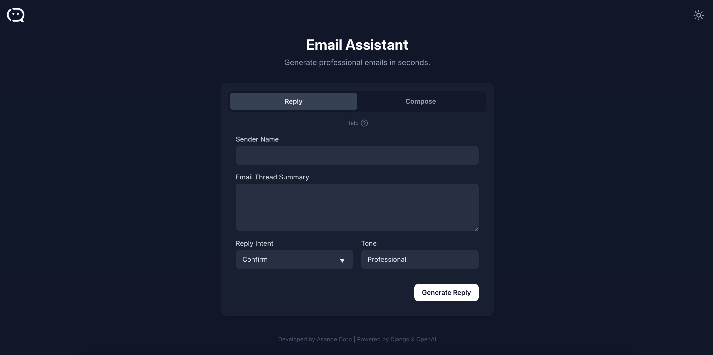
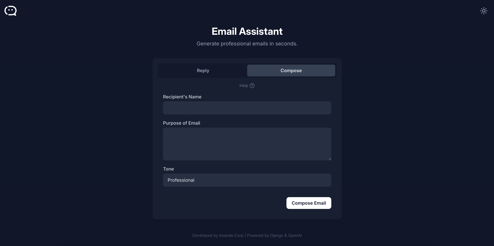

# AI Email Assistant

A simple web application for generating email replies and compositions using AI, built with Django and deployed on AWS Lambda using Zappa.






## Table of Contents

- [Overview](#overview)
- [Key Features](#key-features)
- [Requirements](#requirements)
- [Installation](#installation)
- [API Endpoints](#api-endpoints)
- [Deployment with Zappa](#deployment-with-zappa)
- [Security Considerations](#security-considerations)
- [License](#license)
- [Contact](#contact)

## Overview

This project is a web-based AI Email Assistant built with Django. It provides a clean, minimalist user interface for two main functions: generating contextual replies to existing email threads and composing new emails from scratch. The backend is powered by the DeepSeek API for content generation and is designed for serverless deployment on AWS Lambda via Zappa.

## Key Features

- **AI-Powered Generation**: Utilises a powerful language model to generate human-like email content for both replies and new compositions.
- **Context-Aware Replies**: Considers the sender, thread summary, and user's intent to create relevant and accurate responses.
- **Minimalist UI**: A modern, responsive user interface with both light and dark modes.
- **Serverless Deployment**: Optimised for deployment on AWS Lambda using Zappa.
- **Usage Notifications**: Sends an email notification to the admin each time the service is used.

## Requirements

### Software Dependencies

- Python 3.13+
- Django 5.2+
- `requests`
- `openai` (for DeepSeek API)
- `django-cors-headers`
- `zappa`
- See `requirements.txt` for the full list

### API Key

The application requires an API key for the DeepSeek service, stored as an environment variable.

### Optional (for deployment)

- AWS account with permissions for Lambda, API Gateway, S3, and IAM
- AWS CLI configured

## Installation

### Local Setup

1. Clone the repository:

   ```bash
   git clone https://github.com/phathwa/email-assistant.git
   cd email-assistant
   ```
